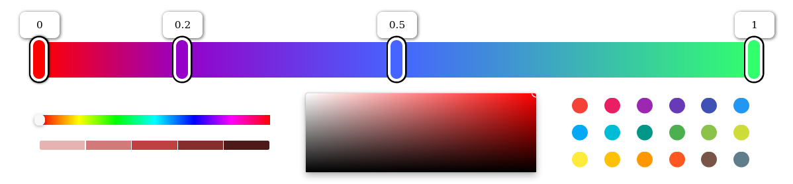

    <h2>react-d3-plots</h2>
  

    
  

 

  <h3 align="center">
    React plots drawn on canvas using D3.js.  
  </h3>
  <ul style='margin-top: 10px'>
    <li><b>Typescript</b> support</li>
     <li>Highly customizable</li>
    <li>Lightweight: <b> <100 kB </b> </li>
    <li>Performant thanks to the use of canvas</li>
  </ul>

  

    <a href="https://react-d3-plots.netlify.app" target="_blank">
    Live playground here 🎨
    </a>
  

## Examples

## Props